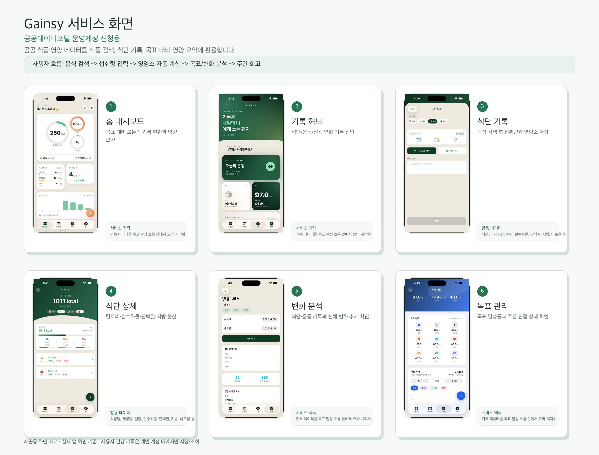

# 공공데이터포털 운영계정 신청 자료

작성일: 2026-06-24  
대상 서비스: Gainsy  
용도: 공공데이터포털 Open API 운영계정 신청 시 서비스 설명 및 서비스 화면 첨부

---

## 1. 신청서 입력용 요약

### 서비스명

Gainsy

### 서비스 URL

- 서비스 소개: https://gainsy.site
- 운영 API: https://api.gainsy.site

### 서비스 한 줄 설명

Gainsy는 사용자가 운동, 식단, 신체 변화, 목표를 함께 기록하고 주간 단위로 자신의 변화를 확인할 수 있도록 돕는 iOS 기반 건강관리 서비스입니다.

### 서비스 상세 설명

Gainsy는 사용자가 운동 기록, 식단 기록, 체중·체지방률·근육량 등 신체 변화 기록을 한곳에 저장하고, 목표 대비 진행 상황을 확인할 수 있도록 지원하는 건강관리 앱입니다. 사용자는 식단 기록 화면에서 음식명을 검색하고 섭취량을 입력하면, 공공 식품 영양성분 데이터를 기반으로 열량, 탄수화물, 단백질, 지방, 당류, 나트륨 등의 영양 정보를 확인할 수 있습니다.

공공데이터는 식품 검색, 식단 기록 저장, 일일 영양 합계 계산, 목표 대비 영양 섭취 현황 표시, 변화 분석 및 주간 회고 화면의 기초 데이터로 활용됩니다. 사용자의 개인 건강 기록은 서비스 내부 계정에만 저장되며, 공공데이터 API에는 사용자 개인정보나 민감 건강정보를 전송하지 않습니다.

### 운영계정 신청 사유

Gainsy는 실제 운영 서비스에서 식품 영양성분 검색과 식단 기록 계산 기능을 안정적으로 제공해야 합니다. 개발계정의 제한된 호출 환경만으로는 초기 식품 카탈로그 적재, 정기 갱신, 데이터 보강 및 운영 검증을 안정적으로 수행하기 어렵기 때문에 운영계정 전환이 필요합니다.

공공데이터 API는 사용자 요청마다 실시간 호출하지 않고, 서버의 관리자 배치 작업을 통해 내부 식품 카탈로그에 적재한 뒤 앱에서는 내부 DB를 조회하는 방식으로 사용합니다. 이를 통해 공공 API 호출량을 관리하고, 사용자에게는 안정적인 검색·기록 경험을 제공합니다.

---

## 2. 활용 공공데이터

| 데이터 | 활용 목적 | 주요 활용 항목 |
|---|---|---|
| 전국통합식품영양성분정보 가공식품 표준데이터 | 가공식품 검색 및 식단 기록 계산 | 식품코드, 식품명, 제조사명, 기준량, 열량, 탄수화물, 단백질, 지방, 당류, 나트륨, 기준일자 |
| 전국통합식품영양성분정보 음식 표준데이터 | 음식·외식 메뉴 검색 및 식단 기록 계산 | 식품코드, 식품명, 업체명, 1회 분량 참고량, 식품중량, 열량, 탄수화물, 단백질, 지방, 나트륨, 데이터생성일자 |
| 식품영양성분DB정보 `FoodNtrCpntDbInfo02` | 제공량, 식품중량, 제조사/업체명, 영양성분 보강 | 식품코드, 식품명, 식품분류, 제조사/판매사, 제공량, 식품중량, 열량, 단백질, 탄수화물, 지방, 당류, 나트륨 |

참고 링크:

- [공공데이터포털 - 전국통합식품영양성분정보(음식)표준데이터](https://www.data.go.kr/data/15100070/standard.do)
- 식품영양성분 통합DB: https://various.foodsafetykorea.go.kr/nutrient

---

## 3. 사용자 이용 흐름

1. 사용자가 목표와 기본 프로필을 설정합니다.
2. 식단 기록 화면에서 음식명을 검색합니다.
3. 내부 식품 카탈로그에서 공공데이터 기반 식품 정보를 조회합니다.
4. 사용자가 섭취량을 입력하면 열량과 주요 영양소를 계산합니다.
5. 홈, 식단 상세, 변화 분석, 주간 회고 화면에서 목표 대비 섭취 현황과 변화 추세를 확인합니다.

---

## 4. 서비스 화면

### 제출용 합본 이미지

공공데이터포털 첨부용으로 사용할 수 있는 합본 이미지를 생성했습니다.



파일 위치:

```text
docs/screenshots/public-data-portal-operation-account-screen-pack.png
```

### 개별 화면 설명

| 화면 | 파일 | 설명 |
|---|---|---|
| 홈 대시보드 | `docs/screenshots/home.png` | 오늘의 기록 현황, 칼로리와 매크로 목표 현황을 요약합니다. |
| 기록 허브 | `docs/screenshots/기록메인페이지.png` | 사용자가 식단, 운동, 신체 변화 기록으로 진입하는 화면입니다. |
| 식단 기록 | `docs/screenshots/식단기록페이지.png` | 음식 검색, 사진 분석, 식품 추가, 섭취량 입력을 수행하는 화면입니다. |
| 식단 상세 | `docs/screenshots/diet.png` | 저장된 식단의 열량, 탄수화물, 단백질, 지방 합계를 표시합니다. |
| 변화 분석 | `docs/screenshots/변화분석페이지.png` | 식단·운동 기록과 신체 변화 추세를 함께 확인합니다. |
| 목표 관리 | `docs/screenshots/goals.png` | 사용자의 목표와 진행률을 확인합니다. |

---

## 5. 데이터 처리 및 보안 설명

- 공공데이터 API 서비스키는 서버 환경변수로만 관리하며 iOS 앱 클라이언트에 노출하지 않습니다.
- 공공데이터 API에는 사용자 ID, 이메일, 신체 측정값, 식단 기록 메모, 사진 등 개인정보나 민감 건강정보를 전송하지 않습니다.
- 공공데이터는 관리자 배치 또는 운영 보강 작업을 통해 내부 `food_catalog`에 적재합니다.
- 사용자가 앱에서 음식을 검색할 때는 내부 DB를 조회하므로, 사용자 검색어와 개인 기록이 공공 API 제공기관으로 전달되지 않습니다.
- 식품명 중복, 제공량 차이, 영양성분 결측은 내부 정규화·중복 제거·검수 상태로 관리합니다.
- 사용자 커스텀 식품은 공공데이터와 구분하여 `USER_CUSTOM` 출처로 저장합니다.

---

## 6. 호출 방식 및 트래픽 계획

### 호출 방식

- 초기 운영 적재: 데이터셋별 페이지 단위 배치 호출
- 정기 갱신: 수정일 또는 데이터 기준일자를 기준으로 주기적 보강
- 사용자 앱 이용 중 실시간 호출: 없음
- 장애 시 처리: 배치 실패 기록 후 재시도하며, 기존 내부 카탈로그로 서비스 지속

### 호출량 관리

- 페이지 단위 요청 사이에 지연 시간을 둘 수 있도록 `importPageDelayMillis` 설정을 사용합니다.
- 데이터셋별 체크포인트를 저장해 중복 호출을 줄입니다.
- 운영 중 일반 사용자 트래픽 증가가 공공 API 호출량 증가로 직접 이어지지 않도록 내부 DB 조회 구조를 유지합니다.

---

## 7. 신청서 복사용 문구

### 활용 목적

Gainsy는 운동·식단·신체 변화 기록을 기반으로 사용자의 건강 목표 달성을 돕는 iOS 건강관리 서비스입니다. 공공 식품 영양성분 데이터는 사용자가 식단을 기록할 때 음식 검색 결과와 열량, 탄수화물, 단백질, 지방, 나트륨 등 영양성분 정보를 제공하고, 기록된 식단의 일일 합계와 목표 대비 섭취 현황을 계산하는 데 활용됩니다.

### 운영계정 필요 사유

실제 운영 서비스에서 식품 카탈로그 초기 적재, 정기 갱신, 영양성분 보강을 안정적으로 수행하기 위해 운영계정이 필요합니다. API는 사용자 요청마다 직접 호출하지 않고 서버 배치로 내부 DB에 적재한 뒤 앱에서는 내부 DB를 조회하는 방식으로 사용하여 공공 API 호출량을 관리하고 서비스 안정성을 확보합니다.

### 개인정보 처리

공공데이터 API 호출에는 사용자 개인정보, 계정정보, 신체 측정값, 식단 기록, 사진 등 민감정보를 포함하지 않습니다. API 서비스키는 서버 환경변수로 관리하고 앱 클라이언트에는 노출하지 않으며, 사용자의 개인 기록은 Gainsy 내부 계정 데이터로만 저장·조회합니다.

---

## 8. 구현 근거

- API 설정: `backend/src/main/java/com/healthcare/domain/diet/external/config/ExternalApiProperties.java`
- 식품 카탈로그 출처: `backend/src/main/java/com/healthcare/domain/diet/entity/FoodCatalogSource.java`
- 식품 카탈로그 운영 가이드: `docs/FOOD_CATALOG_GUIDE.md`
- 서비스 화면 합본: `docs/screenshots/public-data-portal-operation-account-screen-pack.png`
